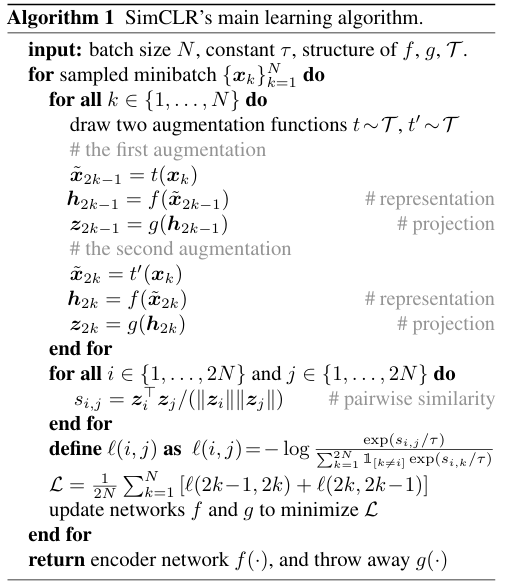
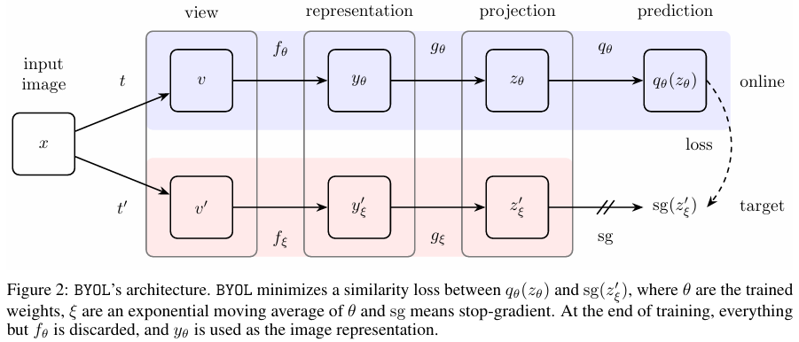

| Method |                                                 Pub.                                                 | Figure                                                                                                                                                                                                                           |                                                                                                                                                                                                                                                     Links                                                                                                                                                                                                                                                     |
|--------|:----------------------------------------------------------------------------------------------------:|----------------------------------------------------------------------------------------------------------------------------------------------------------------------------------------------------------------------------------|:-------------------------------------------------------------------------------------------------------------------------------------------------------------------------------------------------------------------------------------------------------------------------------------------------------------------------------------------------------------------------------------------------------------------------------------------------------------------------------------------------------------:|
| MoCo   |  CVPR 2019    |                                                                                                                                                                                             |                                                                                                                |
| SimCLR |  ICML 2020    | 

 |                                                                                                                                          |
| BYOL   | NeurIPS 2020  |                                                                                                                                                                                                 |                                                                           |
| iBOT   |  ICLR 2021    |                                                                                                                                                                                             |     |
| DINO   |  ICCV 2021    | 

             |                                      |
| JEPA   |  CVPR 2023    |                                                                                                                                                                                             |            |
